# Итоговый проект. Двухсервисная система LLM-консультаций

Распределённая система из двух независимых сервисов:

- **Auth Service (FastAPI)** - регистрация пользователей, логин и выпуск JWT. Единственное место, где создаются токены и хранятся пользователи.
- **Bot Service (aiogram)** - Telegram-бот LLM-консультаций. Не знает ничего о пользователях и паролях: доверяет только корректно подписанному и не истёкшему JWT, выданному Auth Service. Запросы к LLM обрабатываются асинхронно через **Celery + RabbitMQ + Redis**.

---

## Содержание

- [Архитектура](#архитектура)
- [Стек](#стек)
- [Структура проекта](#структура-проекта)
- [Запуск](#запуск)
- [Сценарий работы пользователя](#сценарий-работы-пользователя)
- [Тестирование](#тестирование)
- [Демонстрация работы](#демонстрация-работы)
- [Безопасность](#безопасность)

---

## Архитектура

```
                 ┌──────────────────────┐
  Swagger UI ───▶│  Auth Service :8000  │   FastAPI + SQLAlchemy (SQLite)
  (регистрация,  │  /auth/register      │   bcrypt-хеши паролей
   логин)        │  /auth/login → JWT   │   JWT: sub, role, iat, exp (HS256)
                 │  /auth/me            │
                 └──────────┬───────────┘
                            │  JWT (пользователь копирует токен)
                            ▼
  Telegram ────▶ ┌──────────────────────┐      delay()       ┌────────────┐
  пользователь   │  Bot Service (aiogram)│ ───────────────▶  │  RabbitMQ  │
  /token <jwt>   │  валидация JWT        │   задача          │  (broker,  │
  текст вопроса  │  токен → Redis        │   llm_request     │  очередь   │
                 └──────────┬───────────┘                    │  "llm")    │
                            │ token:<tg_user_id>             └─────┬──────┘
                            ▼                                      │
                 ┌──────────────────────┐                          ▼
                 │        Redis         │◀──────────┐    ┌──────────────────┐
                 │  • JWT по user_id    │  результат │   │  Celery worker   │
                 │  • result backend    │            └───│  → OpenRouter    │
                 │  • result:<chat_id>  │                │  → ответ в TG    │
                 └──────────────────────┘                └──────────────────┘
```

**Принцип разделения ответственности:**

- JWT **создаётся только** в Auth Service; Bot Service **только валидирует** подпись, `exp` и наличие `sub` (общий `JWT_SECRET`, HS256).
- Bot Service не содержит регистрации/логина, не хранит пользователей и не обращается к базе Auth Service.
- LLM-запросы **не выполняются в Telegram-хэндлерах**: бот публикует задачу `llm_request` в RabbitMQ, Celery worker вызывает OpenRouter, кладёт результат в Redis и отправляет ответ пользователю.
- Redis реально участвует в логике: хранит JWT, привязанный к `tg_user_id` (`token:<id>`), служит result backend Celery и хранит последний ответ (`result:<chat_id>`).

---

## Стек

- Python 3.12+
- FastAPI + Uvicorn (ASGI) — Auth Service API
- aiogram 3.x — Telegram-бот (long polling)
- SQLAlchemy 2.x (async) + aiosqlite — ORM и БД (SQLite)
- Pydantic v2 + pydantic-settings — валидация и конфигурация
- python-jose (JWT HS256) — создание и проверка токенов
- passlib + bcrypt — хеширование паролей
- httpx — HTTP-клиент к OpenRouter
- Celery 5.x — асинхронная обработка LLM-запросов
- RabbitMQ — брокер задач (очередь `llm`)
- Redis — хранение JWT по `tg_user_id`, result backend Celery
- Docker Compose — оркестрация 6 контейнеров
- uv — менеджер окружения и зависимостей
- ruff — линтер
- pytest + httpx + fakeredis + respx + pytest-mock — тестирование

---

## Структура проекта

```
llm-consult/
├── auth_service/
│   ├── app/
│   │   ├── main.py               # сборка приложения (lifespan, роутеры, exception handlers, /health)
│   │   ├── core/
│   │   │   ├── config.py         # pydantic-settings
│   │   │   ├── security.py       # bcrypt + create_access_token / decode_token
│   │   │   └── exceptions.py     # BaseHTTPException и доменные ошибки (401/403/404/409)
│   │   ├── db/
│   │   │   ├── base.py           # DeclarativeBase
│   │   │   ├── session.py        # async engine + async_sessionmaker
│   │   │   └── models.py         # User (уникальный индекс по email)
│   │   ├── schemas/              # RegisterRequest, TokenResponse, UserPublic
│   │   ├── repositories/users.py # только операции БД
│   │   ├── usecases/auth.py      # register / login / me
│   │   └── api/
│   │       ├── deps.py           # get_db, get_users_repo, get_auth_uc, get_current_user
│   │       ├── routes_auth.py    # /auth/register, /auth/login, /auth/me
│   │       └── router.py         # сборка роутеров
│   ├── tests/                    # unit (security) + интеграционные (httpx ASGITransport, in-memory SQLite)
│   ├── pytest.ini
│   ├── pyproject.toml
│   ├── .env
│   └── Dockerfile
├── bot_service/
│   ├── app/
│   │   ├── main.py               # FastAPI: /health
│   │   ├── core/
│   │   │   ├── config.py         # pydantic-settings
│   │   │   └── jwt.py            # decode_and_validate (только проверка!)
│   │   ├── infra/
│   │   │   ├── redis.py          # get_redis() — singleton-клиент
│   │   │   └── celery_app.py     # broker=RabbitMQ, backend=Redis, очередь "llm"
│   │   ├── tasks/llm_tasks.py    # задача llm_request
│   │   ├── services/openrouter_client.py  # httpx-клиент /chat/completions
│   │   └── bot/
│   │       ├── dispatcher.py     # сборка Bot + Dispatcher
│   │       ├── handlers.py       # /start, /token <jwt>, текст → Celery
│   │       └── run.py            # entrypoint long polling
│   ├── tests/                    # unit (JWT), мок-тесты (fakeredis + pytest-mock), respx (OpenRouter)
│   ├── pytest.ini
│   ├── pyproject.toml
│   ├── .env
│   └── Dockerfile
├── docker-compose.yml
├── docs/screenshots/             # скриншоты для отчёта
└── README.md
```

---

## Запуск

### 1. Подготовка

В `bot_service/.env` заполните:

```env
TELEGRAM_BOT_TOKEN=<токен от @BotFather>
OPENROUTER_API_KEY=<ключ с openrouter.ai>
```

Секрет `JWT_SECRET` должен совпадать в обоих `.env` (по умолчанию совпадает).

### 2. Запуск через Docker Compose 

```bash
docker compose up --build
```

Поднимаются: `auth_service` (:8000), `redis` (:6379), `rabbitmq` (:5672, UI :15672), `bot_api` (:8001), `bot` (polling), `worker` (Celery, очередь `llm`).

- Swagger Auth Service: http://localhost:8000/docs
- RabbitMQ Management UI: http://localhost:15672 (guest / guest)

### 3. Локальный запуск через uv (без Docker)

```bash
# Auth Service
cd auth_service
uv venv && uv pip install -r pyproject.toml
uv run uvicorn app.main:app --host 0.0.0.0 --port 8000

# Bot Service (нужны запущенные Redis и RabbitMQ; в .env замените хосты на localhost)
cd bot_service
uv venv && uv pip install -r pyproject.toml
uv run python -m app.bot.run                                   # бот
uv run celery -A app.infra.celery_app:celery_app worker -Q llm # воркер
```

---

## Сценарий работы пользователя

1. Открыть Swagger http://localhost:8000/docs.
2. `POST /auth/register` - зарегистрироваться. **Email в формате `surname@email.com`**.
3. `POST /auth/login` (form-data: username = email, password) - получить `access_token`.
4. Проверить `GET /auth/me` с заголовком `Authorization: Bearer <token>` (в Swagger — кнопка Authorize).
5. В Telegram отправить боту `/token <access_token>` - бот валидирует JWT и сохранит его в Redis под ключом `token:<tg_user_id>`.
6. Отправить боту любой вопрос. Бот ответит «Запрос принят», опубликует задачу `llm_request` в RabbitMQ, Celery worker вызовет OpenRouter и пришлёт ответ в чат.
7. Без токена (или с истёкшим/подделанным токеном) бот отказывает в доступе и просит авторизоваться через Auth Service.

---

## Тестирование

Тесты проходят локально **без Docker, Redis, RabbitMQ и интернета**: внешние зависимости замоканы (`fakeredis`, `pytest-mock`, `respx`, in-memory SQLite).

```bash
cd auth_service && uv run pytest -v   # 13 тестов
cd bot_service  && uv run pytest -v   # 13 тестов
```

**Auth Service:**
- unit: bcrypt-хеширование (хеш ≠ пароль, verify верного/неверного пароля), генерация и декодирование JWT (`sub`, `role`, `iat`, `exp`), истёкший и мусорный токен.
- интеграционные (httpx ASGITransport + подмена `get_db` на in-memory SQLite): полный поток register → login (form-data) → `/auth/me` с Bearer-токеном.
- негативные: повторная регистрация → 409, неверный пароль → 401, `/auth/me` без токена / с неверным токеном → 401.

**Bot Service:**
- unit: `decode_and_validate` - корректный токен возвращает `sub`; мусор, неверная подпись, истёкший токен, отсутствие `sub` → ошибка.
- мок-тесты хэндлеров: `/token <jwt>` сохраняет токен в fakeredis под `token:<tg_user_id>`; без токена Celery не вызывается; с токеном вызывается `llm_request.delay(chat_id, text)` (мок через pytest-mock) и пользователь получает «Запрос принят»; истёкший токен удаляется из Redis.
- интеграционные: клиент OpenRouter через respx-мок `POST /chat/completions` - корректный payload, извлечение `choices[0].message.content`, обработка не-200 и неожиданного формата.

---

## Демонстрация работы

> **Примечание о модели LLM.** На момент выполнения работы модель `stepfun/step-3.5-flash:free`, указанная в задании, не поддерживается сервисом OpenRouter (при обращении возвращается `HTTP 404`). В связи с этим в `.env` использована актуальная бесплатная модель `nvidia/nemotron-3-ultra-550b-a55b:free`.

Все скриншоты лежат в `docs/screenshots/` (формат PNG, имена файлов фиксированы — при их наличии картинки отображаются ниже автоматически).

### Auth Service (Swagger)

`POST /auth/register` - регистрация пользователя, email в формате `surname@email.com`, ответ 201 без `password_hash`:

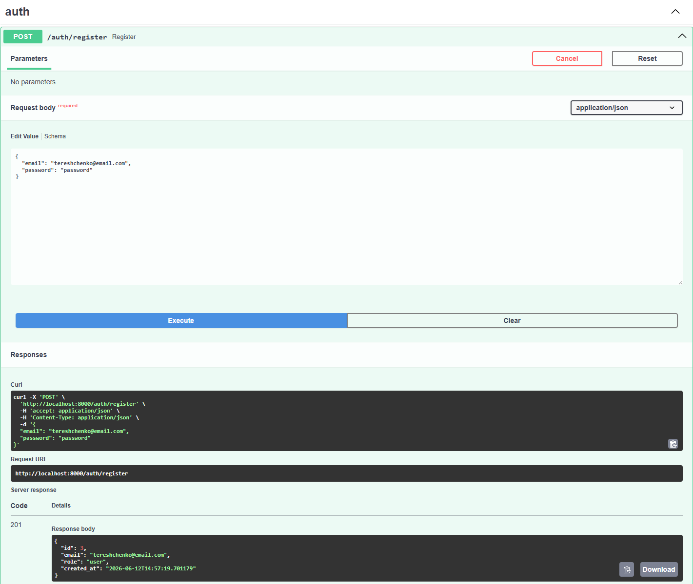

`POST /auth/login` — логин через form-data (`OAuth2PasswordRequestForm`), в ответе выдан `access_token`:

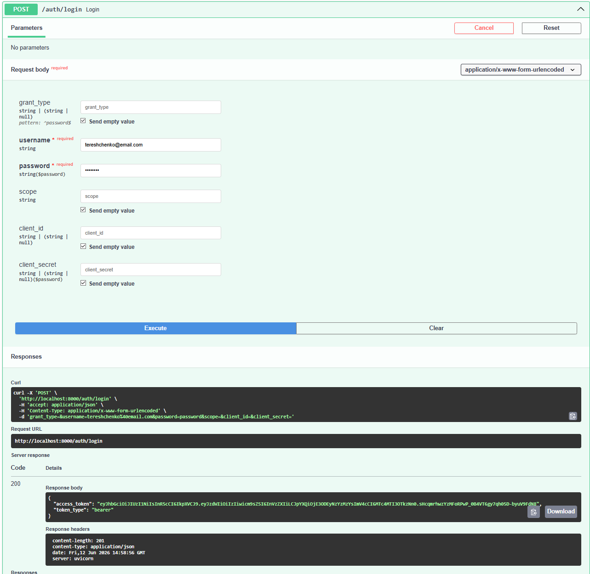

`GET /auth/me` - профиль пользователя доступен только с валидным Bearer-токеном:

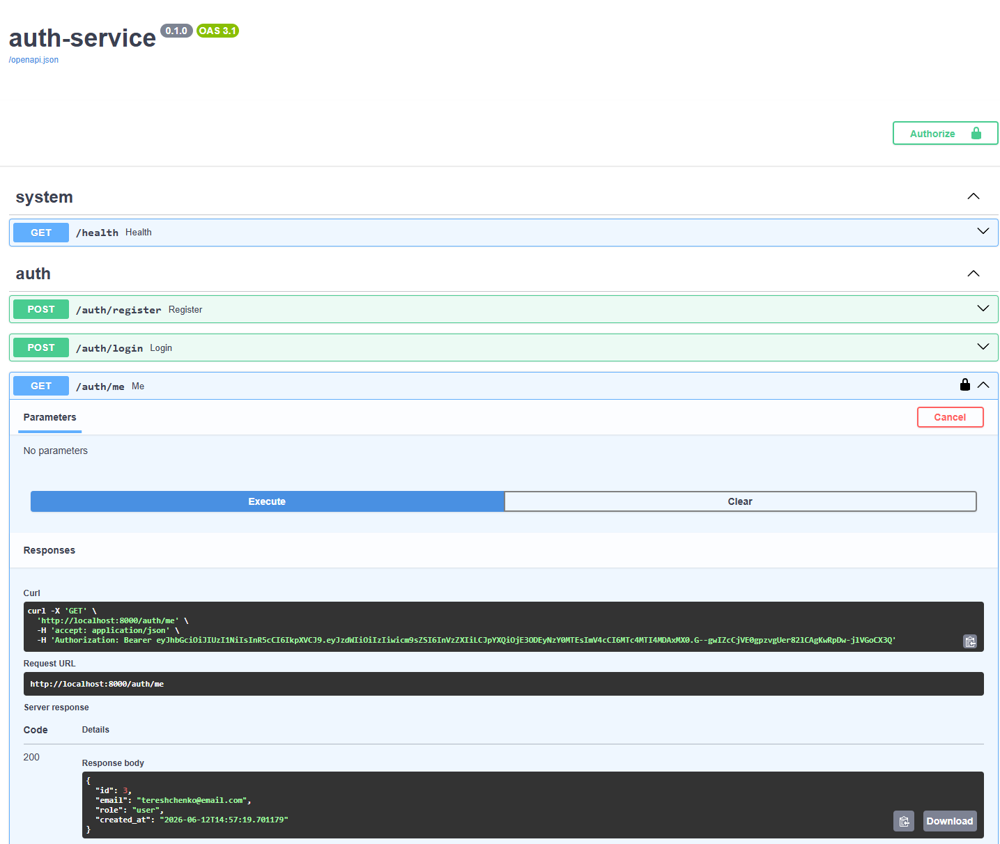

### Telegram-бот (авторизация по JWT)

Без сохранённого токена бот отказывает в доступе и направляет в Auth Service:

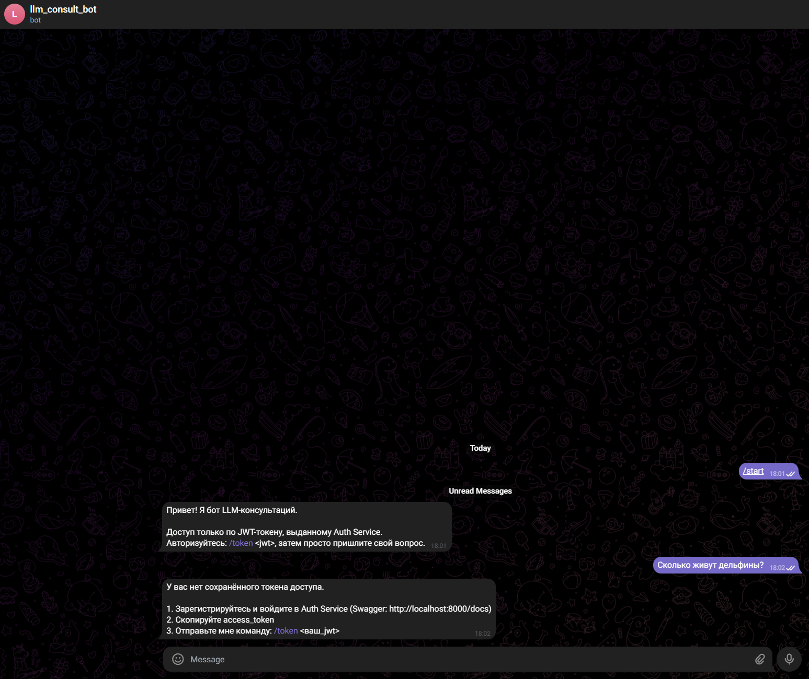

Команда `/token <jwt>` - бот валидирует подпись и срок действия токена и сохраняет его в Redis под ключом `token:<tg_user_id>`:

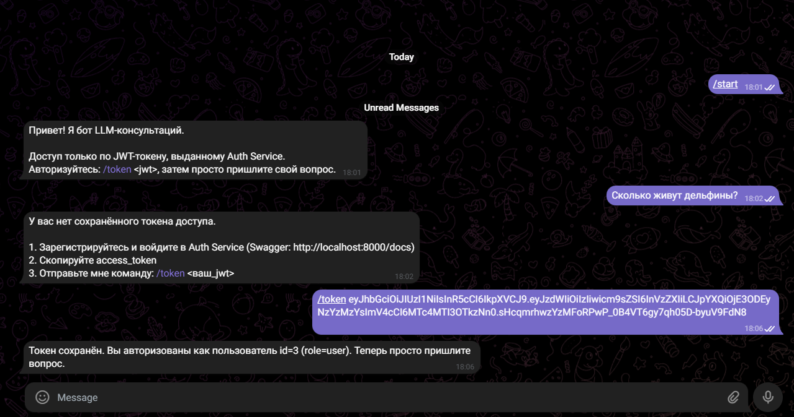

Вопрос пользователя → мгновенное «Запрос принят» (задача опубликована в RabbitMQ) → ответ LLM от Celery-воркера:

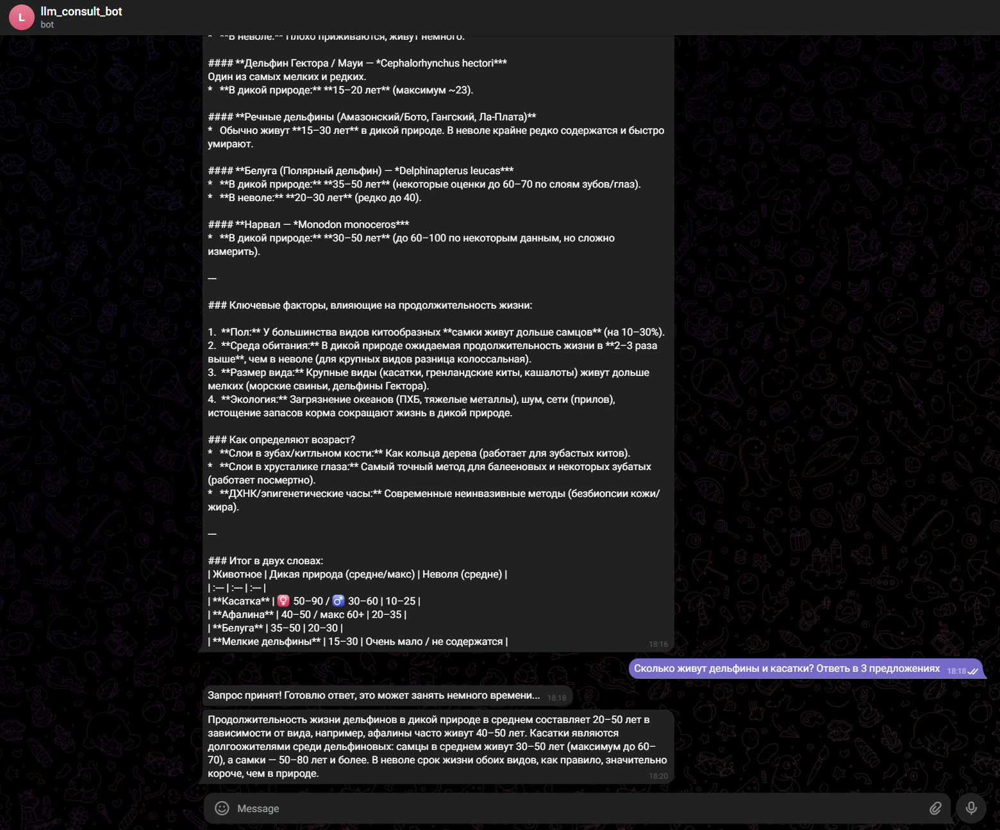

Логи Celery-воркера: задача `llm_request` получена → POST к OpenRouter (200 OK) → sendMessage в Telegram (200 OK) → задача завершена:

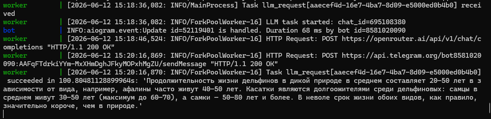

### RabbitMQ (асинхронная цепочка)

Очередь `llm` в RabbitMQ Management UI: подключённый consumer (Celery worker) и ненулевой message rate - очередь реально участвует в обработке:

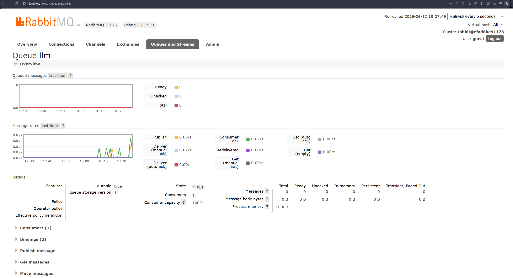

Буферизация задач при остановленном воркере: Ready = 4, Consumers = 0 - сообщения копятся в очереди и будут обработаны после перезапуска воркера:

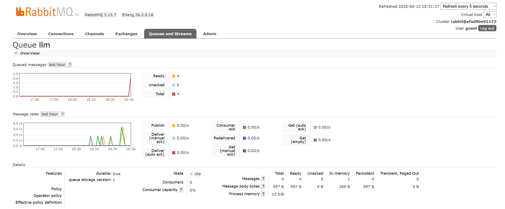

### Тесты

Auth Service - 13 тестов (unit + интеграционные + негативные), локально, без Docker:

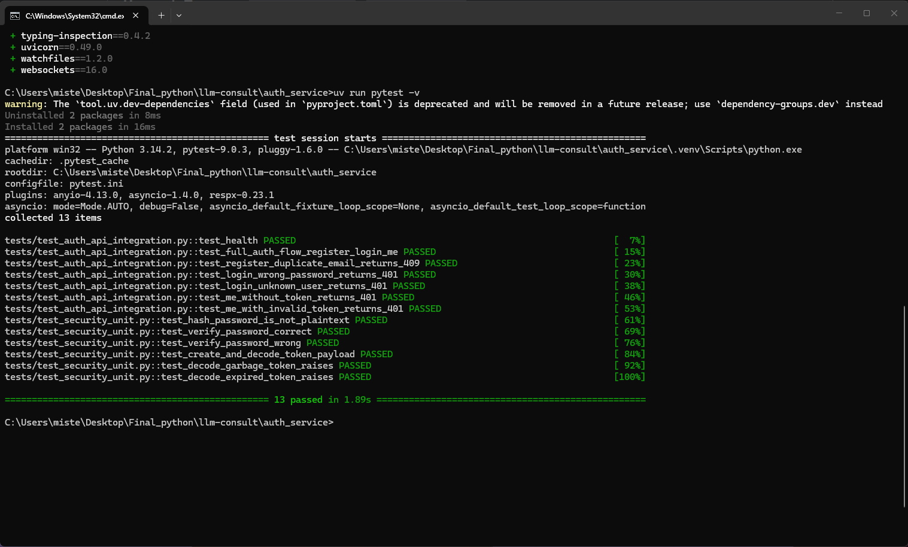

Bot Service - 13 тестов (unit JWT + мок-тесты хэндлеров + respx-тесты OpenRouter):

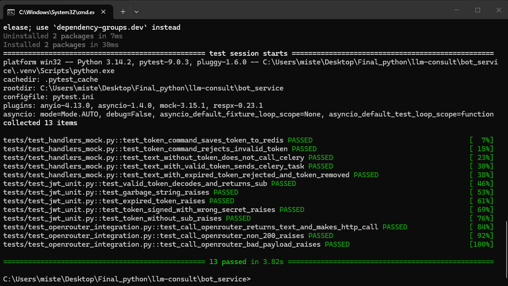

---

## Безопасность

- Пароли хранятся только в виде bcrypt-хеша (`passlib`), в ответах API `password_hash` отсутствует.
- JWT (HS256) содержит `sub`, `role`, `iat`, `exp`; подпись и срок действия проверяются в обоих сервисах.
- Уникальность email защищена уникальным индексом на уровне БД.
- В учебном варианте используется общий `JWT_SECRET`; в продакшене предпочтителен RS256 с публичным ключом на стороне Bot Service.
